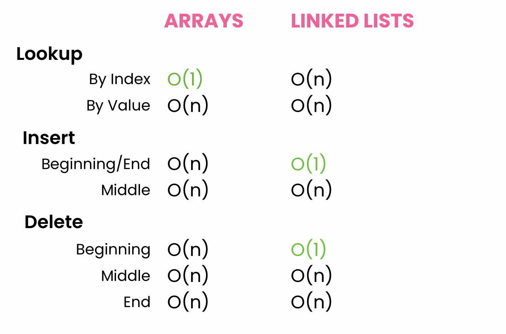

# Linked List


## Operation Time complexity

### Lookup

- **By Value** : `O(n)`
- **By Index** : `O(n)`

### Insert

- **At the End** : `O(1)`
- **At the Beginning** : `O(1)`
- **At the Middle** : `O(n)`

### Delete

- **From the Beginning** : `O(1)`
- **From the End** : `O(n)`
- **From the Middle** : `O(n)`

## LinkedList<T> Operations in Charp

### 1. AddFirst(T value)

- Adds the specified value to the beginning of the linked list.
- Time Complexity: `O(1)`

```csharp
linkedList.AddFirst(5);
```

### 2. AddLast(T value)

- Adds the specified value to the end of the linked list.
- Time Complexity: `O(1)`

```csharp
linkedList.AddLast(10);
```

### 1. AddBefore(LinkedListNode<T> node, T value)

- Adds the specified value before the specified node in the linked list.
- Time Complexity: `O(1)` to find the node, `O(1)` to perform the insertion

```csharp
var node = linkedList.Find(5);
linkedList.AddBefore(node, 7);
```

### 1. AddAfter(LinkedListNode<T> node, T value)

Adds the specified value after the specified node in the linked list.

```csharp
var node = linkedList.Find(5);
linkedList.AddAfter(node, 8);
```

### 1. Remove(T value)

- Removes the first occurrence of the specified value from the linked list.
- Time Complexity: `O(n)` in the worst case (when the element is not at the beginning or end of the list), as it may require traversing the list to find the element to remove.

```csharp
linkedList.Remove(10);
```

### 1. RemoveFirst()

- Removes the node at the beginning of the linked list.
- Time Complexity: `O(1)`

```csharp
linkedList.RemoveFirst();
```

### 1. RemoveLast()

- Removes the node at the end of the linked list.
- **Time Complexity**: `O(n)` in the worst case, as it may require traversing the list to find the last element before removing it.

```csharp
linkedList.RemoveLast();
```

### 1. Find(T value)

- Finds the first node that contains the specified value.
- Time Complexity: `O(n)` in the worst case, as it may require traversing the list to find the specified value.

```csharp
var node = linkedList.Find(5);
```

### 1. Contains(T value)

- Determines whether the linked list contains the specified value.
- Time Complexity: `O(n)`, similar to Find, as it also involves traversing the list.

```csharp
bool containsValue = linkedList.Contains(7);
```

## Custom Implementation

### Node Class

```cs
public class Node<T>
{
    public T Value { get; set; }
    public Node<T> Next { get; set; }

    public Node(T value)
    {
        Value = value;
        Next = null;
    }
}
```

### LinkedList Class

```cs
public class HwLinkedList<T>
{
    private Node<T> Head { get; set; }
    private Node<T> Tail { get; set; }
}
```

### AddLast

```cs
    public void AddLast(T value)
    {
        var newNode = new Node<T>(value);

        if (IsEmpty())
            Head = Tail = newNode;
        else
        {
            //point newNode as next-node for current-last-node
            Tail.Next = newNode;
            //update last node of linkedList
            Tail = newNode;
        }
    }
```

### AddFirst

```cs
    public void AddFirst(T value)
    {
        var newNode = new Node<T>(value);

        if (IsEmpty())
            Tail = Head = newNode;
        else
        {
            //point current-first-node as next-node for newNode
            newNode.Next = Head;
            //update first node of linkedList
            Head = newNode;
        }
    }
```

### IndexOf

```cs
    public int IndexOf(T value)
    {
        int index = 0;
        var current = Head;
        while (current != null)
        {
            if (EqualityComparer<T>.Default.Equals(current.Value, value)) return index;
            index++;
            current = current.Next;
        }
        return -1;// Not found
    }
```

## Notes

### LinkedList 🆚 Array



- static arrays have a fixed size.
- dynamic array grow by 50-100% which wast resources.
- linked list don't waste memory.
- use arrays if you know the number of items to store.
